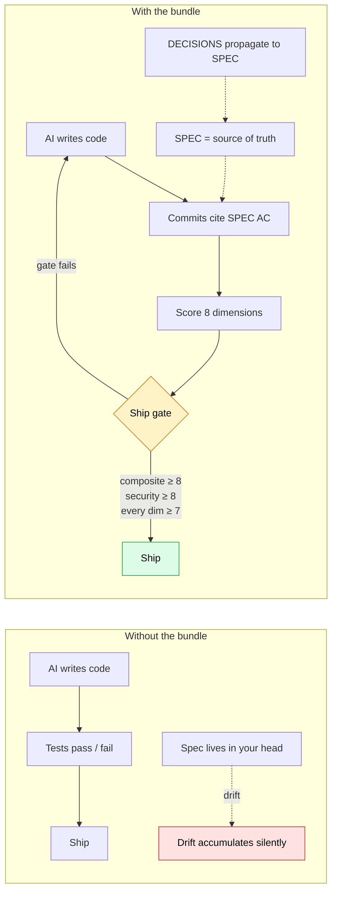
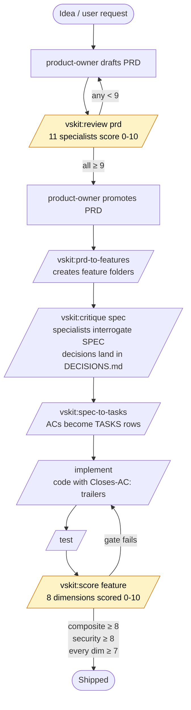

# vertical-slices-md-dev-kit

**AI framework to build solid software apps — PRDs, per-feature markdown specs (vertical slices), contract clauses, and ship gates.**

Adopt it in under an hour and your AI-generated code starts shipping behind quality gates that `git` + `make` + `pytest` don't enforce on their own. The methodology itself is documented in [`vertical-slices-ai-framework.md`](./vertical-slices-ai-framework.md) (v2.0) — the normative spec. This bundle wraps that spec with templates, reference scripts, and a worked example so a stranger can adopt it without reading 1027 lines first.

> **Bundle version:** 2.0 · **License:** MIT · **Status:** Active
>
> **v2.0 changes:** All commands renamed to verb-first form and prefixed `vskit:` to avoid skill collisions. Twelve commands renamed, three deleted. See [`CHANGELOG.md`](./CHANGELOG.md) for the full old→new migration table.
>
> **v1.8 highlight (still active):** Clauses — invariant rules graded by AI with confidence + reasoning, per feature. See [§4.7 in the spec](./vertical-slices-ai-framework.md#47-clauses--invariant-rules-with-confidence-graded-checks) or the demo at [`example/features/demo-counter/CLAUSES.md`](./example/features/demo-counter/CLAUSES.md).

---

## Who this is for

You're a **solo dev or staff engineer** running an AI-assisted greenfield repo (or a small one). You ship a lot of code that Claude / Codex / Cursor / Aider helped write. You can feel that the spec lives in your head and the AI's output drifts from it slowly. You want guardrails that *don't* require a 10-person process team to maintain.

This bundle gives you four things that `git` + `make` + `pytest` do not:

1. **Intent declared before code.** Every commit names which PRD/SPEC acceptance criterion it satisfies.
2. **Quality measured per change, not per release.** Up to 8 named dimensions scored 0–10. Refuses to ship below floor.
3. **Overhead measured per repo.** The bundle records its own cost and forces a drop decision when it stops paying for itself.
4. **Decisions traceable from rationale to commit.** DECISIONS.md → SPEC.md → TASKS.md → commit trailer → audit. Every merged line walks back to the question that motivated it.

The full case is in [`vertical-slices-ai-framework.md`](./vertical-slices-ai-framework.md) §0.1.

## Before / after

What changes in an AI-assisted repo when you adopt the bundle:



The bundle doesn't replace `git`, `pytest`, or `make` — it adds the four things they don't enforce: declared intent before code, per-change quality measurement, repo-level overhead budgeting, and decision-to-commit traceability ([§0.1](./vertical-slices-ai-framework.md#01-what-this-framework-forces-that-git--make--pytest-do-not)).

## The pipeline at a glance



Two gates (yellow) decide what moves forward. Everything else is observable file state — lifecycle is computed, not declared (INV-2).

## What's in this bundle

```
vertical-slices-md-dev-kit/
├── README.md                          ← you are here
├── LICENSE                            ← MIT
├── CONTRIBUTING.md                    ← how to file issues and PRs
├── SECURITY.md                        ← vulnerability disclosure policy
├── CHANGELOG.md                       ← version history
├── ADOPTION.md                        ← under-an-hour adoption tutorial
├── WALKTHROUGH.md                     ← every command simulated end-to-end on one feature
├── vertical-slices-ai-framework.md    ← the spec (1027 lines, normative)
├── settings.json.snippet              ← .claude/settings.json Stop hook block
├── scripts/
│   └── worklog-stop-hook.sh           ← reference implementation of §5.2 Stop hook
├── templates/
│   ├── PRD.md                         ← §3.2 PRD template
│   ├── SPEC.md                        ← §4.3 SPEC template
│   ├── TASKS.md                       ← §4.4 tasks template
│   ├── DECISIONS.md                   ← §4.5 decisions template
│   ├── CLAUSES.md                     ← §4.7 clauses template (v1.8)
│   ├── SCORE.md                       ← §7.3 score template
│   └── CLAUDE.md-snippet.md           ← §9 CLAUDE.md §Commands snippet
├── example/
│   └── features/demo-counter/         ← one fully-populated feature folder (incl. CLAUSES.md)
└── case-studies/
    ├── README.md                      ← what counts as a case study
    ├── 01-self-adoption.md            ← the kit scores its own market-readiness
    └── 02-bab-bootstrap.md            ← (placeholder) first external adoption
```

## Per-feature anatomy — what each markdown file holds

Every adopted feature lives in `docs/features/<slug>/`. Four files are always present; the rest depend on the feature's `Applies:` declaration in the SPEC frontmatter (spec §4.2.1).

| File | Required when | What it captures |
|---|---|---|
| `SPEC.md` | always | Problem statement (§1), in/out scope (§2), independently-verifiable acceptance criteria (§3), NFRs latency/error-budget/auth/quotas/accessibility/security (§4), test specification (§7), open questions (§9), implementation notes (§10) |
| `TASKS.md` | always | Implementation tasks broken from SPEC §3 ACs. Columns: ID, description, owner, priority, status (Pending → In Progress → In Review → Done), linked ACs, source decision ID |
| `DECISIONS.md` | always | Rationale journal — every design decision with: who raised it, the question, the decision, the rationale, which canonical file got updated, and any superseded prior decision. Unresolved items move to `## Deferred Items` (DEF-NN) |
| `SCORE.md` | always | The 8 quality dimensions scored 0–10 (Documentation, Test Coverage, Module Clarity, Requirements Coverage, Logging, Error Handling, Security, NFR Compliance), composite, ship-gate status, drift findings, score history, improvement actions |
| `DBSCHEMA.md` | `Applies: dbschema` | Tables, columns, constraints, indexes, plus migrations (each with Up steps, Down/rollback steps, and a back-compat assertion) |
| `INTERFACE-CONTRACTS.md` | `Applies: interface-contracts` | HTTP/WS/RPC endpoint contracts — request shape, validation rules, response codes/bodies, auth model, rate limits, logging contract |
| `CLAUSES.md` | `Applies: clauses` | Invariant rules graded by AI: severity (Low/Medium/High/Critical), last spec check + last code check verdicts (PASS/FAIL/INDETERMINATE), confidence 0–100%, top-5 enforcement files, reasoning paragraphs, removed/superseded log |
| `prototypes/` | `Applies: prototype` | UX prototype HTML (index.html + assets/) for stakeholder review before code. Served behind basic-auth at `/prototypes/` per spec §6 |

Each of these has a copy-paste skeleton in [`templates/`](./templates/). The [worked example](./example/features/demo-counter/) ships every file populated with realistic content — read it before writing your first feature.

### How they relate

```
PRD.md  (portfolio-wide, one per product)
  ↓ /vskit:prd-to-features
docs/features/<slug>/
  ├── SPEC.md          ← contract: what + acceptance criteria
  │     ↓ /vskit:critique spec  (specialists interrogate)
  │     ↑ updates from
  │   DECISIONS.md     ← rationale journal (the "why")
  │     ↓ propagates to
  │   DBSCHEMA.md      ← schema (if dbschema in Applies)
  │   INTERFACE-CONTRACTS.md  ← endpoints (if interface-contracts in Applies)
  │     ↓
  ├── TASKS.md         ← broken from §3 ACs, tracked to Done
  │     ↓ /vskit:implement feature
  │   code commits with Closes-AC: trailers
  │     ↓ /vskit:score feature
  ├── SCORE.md         ← 8 dims + composite + drift + history
  └── CLAUSES.md       ← invariants (if clauses in Applies); re-checked by /vskit:clause check
```

Read order for a new feature: SPEC → DECISIONS → CLAUSES (if any) → TASKS → SCORE. The first three are *what the feature is*; the last two are *how it gets built and graded*.

## 60-second adoption preview

```bash
# 1. Vendor the kit into your repo (pick one)
git submodule add https://github.com/OWNER/vertical-slices-md-dev-kit.git docs/bundle
# OR a shallow copy:
git clone --depth 1 https://github.com/OWNER/vertical-slices-md-dev-kit.git /tmp/vskit \
  && cp -r /tmp/vskit/. docs/bundle/

# 2. Install the Stop hook
mkdir -p .claude
cat docs/bundle/settings.json.snippet >> .claude/settings.json   # merge by hand if file exists

# 3. Make the hook script executable + point at it
chmod +x docs/bundle/scripts/worklog-stop-hook.sh

# 4. Bootstrap the doc tree
mkdir -p docs/{prds,features,worklog,incidents,process,technical}

# 5. Copy one template and start your first feature
cp docs/bundle/templates/SPEC.md docs/features/my-first-feature/SPEC.md

# 6. Edit your CLAUDE.md to point at the framework
cat docs/bundle/templates/CLAUDE.md-snippet.md   # paste into CLAUDE.md
```

Full walkthrough → [`ADOPTION.md`](./ADOPTION.md)

## What "ready to adopt" means

You can pick this bundle up if:

- You write code with AI assistants and you have a `CLAUDE.md` (or equivalent) in the repo today.
- You ship to one repo, not a portfolio. Cross-repo governance is out of scope (spec §1).
- You're willing to hand-edit markdown. The bundle is not a SaaS — it's a methodology + a few shell scripts.

You should not adopt this bundle if:

- You need a hosted dashboard. The framework is file-based by design (INV-1: single source of truth).
- You're shipping a portfolio of microservices that need shared schemas. The spec is explicit about being per-repo.
- You're allergic to the discipline of writing acceptance criteria before writing code. The bundle does not work without that step.

## How vertical-slices-md-dev-kit is different from…

| Alternative | Difference |
|---|---|
| Plain `CLAUDE.md` instructions | `CLAUDE.md` tells the AI what to do; vertical-slices-md-dev-kit records what got done, with a ship gate |
| [GitHub Spec Kit](https://github.com/github/spec-kit) | Spec Kit scaffolds spec docs; vertical-slices-md-dev-kit adds **scoring**, **lifecycle computed from state**, and **commit-trailer traceability** |
| [BMAD method](https://github.com/bmadcode/BMAD-METHOD) | BMAD orchestrates AI agents for delivery; vertical-slices-md-dev-kit is the **quality layer** under whatever orchestration you already use |
| Cursor / Aider rule files | Editor-scoped style guides; vertical-slices-md-dev-kit is **per-feature lifecycle + scoring + audit** |

### Same task, side-by-side

Ship a feature ("rate-limited POST endpoint") with each approach. The difference is what the repo holds afterwards.

| Step | Plain CLAUDE.md | GitHub Spec Kit | vertical-slices-md-dev-kit |
|---|---|---|---|
| **1. Capture intent** | One paragraph in `CLAUDE.md` | `/specify` generates a SPEC document | PRD §6 line + SPEC §3 ACs (each independently verifiable) |
| **2. Decide auth / rate-limit shape** | In your head; maybe a code comment | Possibly captured in SPEC sections | **DECISIONS.md row** with rationale, citation, and propagation back to SPEC §3 + §4 |
| **3. Implement** | AI writes code; you review | AI writes code; you review | AI writes code; commit carries `Closes-AC: <slug>#AC-NN` + `Decision: D-NN` trailers |
| **4. Test** | Whatever your test runner says | Whatever your test runner says | Test runner + 8 scored dimensions across 8 parallel scorers |
| **5. Gate to ship** | Tests green = ship | Tests green = ship | Composite ≥ 8 AND security ≥ 8 AND every dim ≥ 7 AND `last_scored_sha` current AND no orphan decisions |
| **6. What the repo retains** | The diff + commit message | The SPEC + the diff | SPEC + DECISIONS journal + SCORE history + commit trailers that walk back to the AC and the decision that motivated it |
| **7. Six months later** | "Why does this code check IP again?" Read code, guess. | Read SPEC. Maybe matches. | `git log --grep='Decision: D-04'` → DECISIONS.md D-04 → rationale + alternatives considered + who raised it |

The headline: every approach can ship the same code. Only vertical-slices-md-dev-kit keeps the chain from *the question* to *the line of code* intact — and refuses to ship if any link in that chain breaks.

## Version

This is **v2.0**. See [`CHANGELOG.md`](./CHANGELOG.md) for what changed between versions. The spec carries `**Version:** 2.0` in its frontmatter — that is the authoritative version pointer.

## License

MIT. Bundle and reference scripts: copy, modify, ship, charge for the work you build on top. No attribution required, though a link back is appreciated.

## Spec authority

When the spec disagrees with this README, the README is wrong. Update the README. See `vertical-slices-ai-framework.md` §12.
